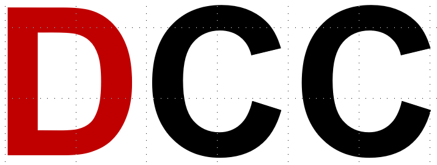

<div align="center">
  <a href="https://ptb.de/dcc" traget="_blank"></a>
  <br />
  <h1>xsd-dcc</h1>
  <p><a href="https://gitlab1.ptb.de/d-ptb/dcc/xsd-dcc/-/commits/master"></a></p>
  <p>This repository contains the XML Schema Definition (XSD), a documentation and examples for the DCC (Digital Calibration Certificate). The XSD is licensed by Physikalisch-Technische Bundesanstalt under [GNU LGPL v3](/COPYING.LESSER).</p>
  <h3>
    [Releases](https://gitlab1.ptb.de/d-ptb/dcc/xsd-dcc/-/releases) | [Documentation](https://ptb.de/dcc/v3.0.0-rc.4/) | [Examples](examples) | [Development Branch](https://gitlab1.ptb.de/d-ptb/dcc/xsd-dcc/-/tree/develop) | [Issues](https://gitlab1.ptb.de/d-ptb/dcc/xsd-dcc/-/issues) | [License](#license) | [Liability](#liability)
  </h3>
</div>
<br />

## Documentation

You can find the Documentation at [https://ptb.de/dcc/v3.0.0-rc.4/](https://ptb.de/dcc/v3.0.0-rc.4/) (Best way to read the documentation).

## License

This repository contains the XML Scheme Definition (XSD), a documentation and examples for the DCC (Digital Calibration Certificate). The XSD is licensed by Physikalisch-Technische Bundesanstalt under [GNU LGPL v3](/COPYING.LESSER).

## Liability

This XSD is distributed in the hope that it will be useful,
but WITHOUT ANY WARRANTY; without even the implied warranty of
MERCHANTABILITY or FITNESS FOR A PARTICULAR PURPOSE. See the
[GNU Lesser General Public License](/COPYING.LESSER) for more details.

## Access to the Schema

To use the Schema use the URL with a specific version below.
This is the recommended way.

```
https://ptb.de/dcc/v3.0.0-rc.4/dcc.xsd
```

```xml
<dcc:digitalCalibrationCertificate
        xmlns:xsi="http://www.w3.org/2001/XMLSchema-instance"
        xsi:schemaLocation="https://ptb.de/dcc https://ptb.de/dcc/v3.0.0-rc.4/dcc.xsd"
        xmlns:dcc="https://ptb.de/dcc"
        xmlns:si="https://ptb.de/si"
        schemaVersion="3.0.0-rc.4">
        <!--
        ...
        -->
</dcc:digitalCalibrationCertificate>
```

## Development

The master branch contains latest stable version. All development is done in the develop branch.

This Project uses [semantic versioning](https://semver.org/).

### Setup

```bash
# Clone this repository
git clone https://gitlab1.ptb.de/d-ptb/dcc/xsd-dcc.git

# Go into the repository
cd xsd-dcc
```

## Team

Contact person: Siegfried Hackel

Alexander Scheibner, Benjamin Gloger, Daniel Hutzschenreuter, Frank Härtig, Jan Henry Loewe, Justin Jagieniak, Lutz Doering, Thomas Wiedenhöfer, Shanna Schönhals, Siegfried Hackel, Wiebke Heeren

