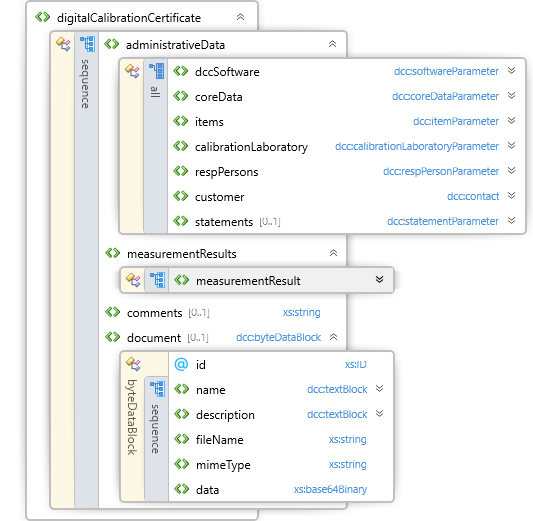

# Digital Calibration Certificate
Im folgenden nur noch DCC genannt.
## Struktur
Der DCC ist in 4 Bereiche (Ringe) gegliedert. Diese sind folgende:

- [administrativeData](administrativeData/README.md)
- [measurementResult](measurementResult/README.md)
- [comment](comment.md)
- [document](document.md)

 | 

## complexTypes des DCC
- [location](complexTypes/location.md)
- [contact](complexTypes/contact.md)
- [hash](complexTypes/hash.md)
- [elementStringWithLang](complexTypes/elementStringWithLang.md)
- [elementStringISO3166](complexTypes/elementStringISO3166.md)
- [elementStringISO639](complexTypes/elementStringISO639.md)
- [textBlock](complexTypes/textBlock.md)
- [byteDataBlock](complexTypes/byteDataBlock.md)
