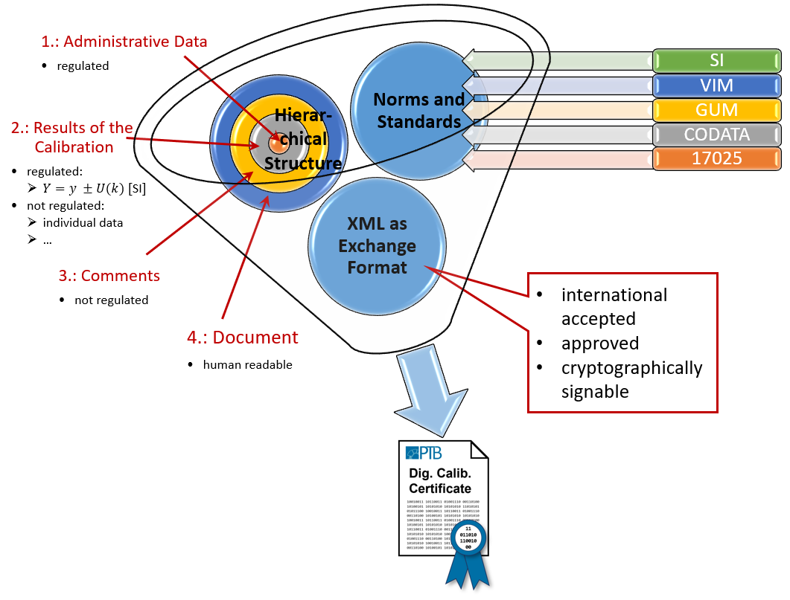

# Digital Calibration Certificate
Der DCC wurde erstmals in der folgenden Veröffentlichung vorgestellt[^1].

[^1]: *Siegfried Hackel, Frank Härtig, Julia Hornig, Thomas Wiedenhöfer:
The Digital Calibration Certificate, PTB-Mitteilungen 127 (2017), Heft 4,
doi: 10.7795/310.20170403*

## Flyer

Der folgende einseitige Flyer gibt einen groben Überblick über den DCC:
[Flyer](../ressources/DCC_Deutsch.pdf)

Zur Zeit ist der Flyer in den Sprachen
[Chinesisch](../ressources/DCC_Chinesisch.pdf),
[Deutsch](../ressources/DCC_Deutsch.pdf),
[Englisch](../ressources/DCC_English.pdf),
[Französisch](../ressources/DCC_Französisch.pdf),
[Koreanisch](../ressources/DCC_Koreanisch.pdf),
[Portugiesisch](../ressources/DCC_Portugiesisch.pdf),
[Russisch](../ressources/DCC_Russisch.pdf) und
[Spanisch](../ressources/DCC_Spanisch.pdf) verfügbar.

## Struktur

Das folgende Bild zeigt die wesentliche Struktur des Digital Calibration Certificate (DCC):

Die Ringstruktur des DCC aus der Abbildung wird auch in dem XML-Schema des DCC abgebildet:

 

[Diagrammsoftware](XSD_diagramviewer.md)

Das Wurzelelement des DCC ist das Element [dcc:digitalCalibrationCertificate](rootelement.md). 
Damit ist auch eine Bedingung der DIN EN ISO/IEC 17025:2018-03 [^2] erfüllt, 
die im Abschnitt 7.8.2.1.a einen Titel fordert.

[^2]: DIN EN ISO/IEC 17025:2018-03 General requirements for the competence of testing 
and calibration laboratories 
