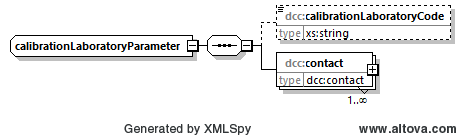
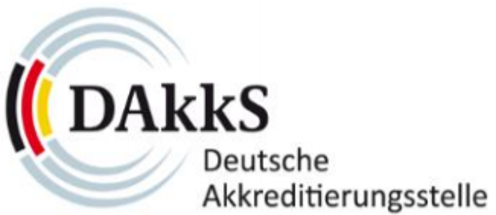

# dcc:calibrationLaboratory

Im Elementtyp *dcc:calibrationLaboratory* sind wesentliche Informationen zum 
Kalibrierlaboratorium hinterlegt.

## Baumstruktur

Die Baumstruktur des Elementtypss *dcc:calibrationLaboratory* hat folgendes Aussehen:



[Diagrammsoftware](../XSD_diagramviewer.md)

## Grobstruktur des Datentyps *dcc:coreDataParameter* vom Element *calibrationLaboratory*
```xml
<xs:complexType name="calibrationLaboratoryParameter">
    <xs:sequence>
        <xs:element name="calibrationLaboratoryCode" type="xs:string" minOccurs="0"/>
        <xs:element name="contact" type="dcc:contact" maxOccurs="unbounded"/>
    </xs:sequence>
</xs:complexType>
```

## Ausfüllanweisungen

Weitere Informationen zu den Ausfüllanweisungen sind in dem Unterabschnitt Elemente
zu finden.

### Mindestangaben

im Folgenden werden die Elemente, die auszufüllen sind, in der Überschrift mit einem 
"[R]" (steht für Required) gekennzeichnet. Optional auszufüllende Elemente 
werden mit einem "[O]" gekennzeichnet. 

Es gibt Elemente, die sind in dem einen Anwendungsfall Pflichtfelder und in dem anderen 
Anwendungsfall nicht zwingend auszufüllen. Diese Elemente werden mit [O|R] gekennzeichnet.

###  
PTB-spezifische Eingaben sind durch das Logo der PTB gekennzeichnet.

### 
DAkkS-spezifische Eingaben sind durch das Logo der DAkkS gekennzeichnet.

### Elemente

#### dcc:calibrationLaboratoryCode [O|R]
Hat das Kalibrierlaboratorium eine ihm zugewiesene Kennung, so ist sie an dieser Stelle 
einzutragen.

Datentyp: [xs:string](https://www.w3.org/TR/xmlschema-2/#string)

##### 

Die PTB hat keine zugewiesene Kennung. Daher bleibt dieses Element leer.

##### 

Die von der Deutschen Akkreditierungsstelle GmbH (DAkkS) akkreditierten 
Kalibrierlaboratorien haben eine Kennung zugewiesen bekommen. Diese ist 
hier einzutragen.

#### dcc:contact [R]

Das Element *contact* enthält alle notwendigen Informationen, um das 
Kalibrierlaboratorium indeutig zu identifizieren. 

Die Struktur des Datentyps *dcc:contact* vom Element *contact* wird 
[hier](../auxElements/contact.md) beschrieben.

