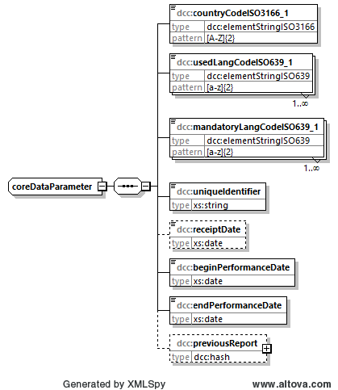

# dcc:coreData

Im Element *dcc:coreData* sind wesentliche Informationen zur globalen Einordnung der 
Kalibrierung zu finden.

## Baumstruktur

Die Baumstruktur des Elements *dcc:coreData* ergibt sich über den Elementtyp 
*dcc:coreDataParameter*. Er hat folgendes Aussehen:



[Diagrammsoftware](../XSD_diagramviewer.md)

## Grobstruktur des Datentyps *dcc:coreDataParameter* vom Element *coreData*
```xml
<xs:complexType name="coreDataParameter">
    <xs:sequence>
        <xs:element name="countryCodeISO3166_1" type="dcc:elementStringISO3166"/>
        <xs:element name="usedLangCodeISO639_1" type="dcc:elementStringISO639" 
        maxOccurs="unbounded"/>
        <xs:element name="mandatoryLangCodeISO639_1" type="dcc:elementStringISO639" 
        maxOccurs="unbounded"/>
        <xs:element name="uniqueIdentifier" type="xs:string"/>
        <xs:element name="receiptDate" type="xs:date" minOccurs="0"/>
        <xs:element name="beginPerformanceDate" type="xs:date" />
        <xs:element name="endPerformanceDate" type="xs:date"/>
        <xs:element name="previousReport" type="dcc:hash" minOccurs="0"/>
    </xs:sequence>
</xs:complexType>
```

## Ausfüllanweisungen

Weitere Informationen zu den Ausfüllanweisungen sind in dem Unterabschnitt Elemente
zu finden.

### Mindestangaben

im Folgenden werden die Elemente, die auszufüllen sind, in der Überschrift mit einem 
"[R]" (steht für Required) gekennzeichnet. Optional auszufüllende Elemente 
werden mit einem "[O]" gekennzeichnet. 

Es gibt Elemente, die sind in dem einen Anwendungsfall Pflichtfelder und in dem anderen 
Anwendungsfall nicht zwingend auszufüllen. Diese Elemente werden mit [O|R] gekennzeichnet.

### 

PTB-spezifische Eingaben sind durch das Logo der PTB gekennzeichnet.

### Elemente

#### dcc:countryCodeISO3166_1 [R]
In welchem Land wurde die Kalibrierung durchgeführt? Die Angabe erfolgt in dem in 
der ISO 3166 festgelegten Ländercode (zwei Großbuchstaben). Nähere Angaben dazu 
finden Sie in der Beschreibung des Datentyps.

Datentyp: [dcc:elementStringISO3166](../auxElements/elementStringISO3166.md)

#####  

Für die in der Bundesrepublik Deutschland ausgestellten DCC's ist "DE" anzugeben:

```xml
<countryCodeISO3166_1>DE</countryCodeISO3166_1>
```

#### dcc:langCodeISO639_1 [R]
Angabe der Amtssprache(n), in denen der DCC erstellt wurde. Die Angabe erfolgt in dem 
in der ISO 639 festgelegten Code für die Amtssprachen (zwei Kleinbuchstaben). 
Nähere Angaben dazu finden Sie in der Beschreibung des Datentyps.

Datentyp: [dcc:elementStringISO639_1](../auxElements/elementStringISO639.md)

#####  

In Deutschland und in der PTB werden sehr oft DCC's in Deutsch (de) und Englisch (en) ausgestellt:

```xml
<langCodeISO639_1>de</langCodeISO639_1>
<langCodeISO639_1>en</langCodeISO639_1>
```

#### dcc:mandatoryLangISO639_1 [R]
Festlegung der Amtssprache(n), die im Zweifelsfall gültig ist. Die Angabe erfolgt 
in dem in der ISO 639 festgelegten Code für die Amtssprachen (zwei Kleinbuchstaben).
Nähere Angaben dazu finden Sie in der Beschreibung des Datentyps.

Datentyp: [dcc:elementStringISO639](../auxElements/elementStringISO639.md)

#####  

In Deutschland und in der PTB wird sehr oft Deutsch (de) angegeben:

```xml
<mandatoryLangISO639_1>de</mandatoryLangISO639_1>
```

#### dcc:uniqueIdentifier [R]
Ein weltweit eindeutiger Identifizierer für den DCC (Kalibrierscheinnummer) ist 
hier anzugeben. Notwendige Bedingung dafür ist, dass der Identifizierer in der 
Organisation, in der das Kalibrierlaboratorium beheimatet ist, eindeutig ist.

Auf das Issue #62 sei verwiesen.

Datentyp: [xs:string](https://www.w3.org/TR/xmlschema-2/#string)

#### dcc:receiptDate [O|R]
Datum des Eingangs des Kalibriergegenstands. Das Datum ist anzugeben, wenn es 
einen zeitlichen Einfluss auf das Kalibrierergebnis hat.

Datentyp: [xs:date](https://www.w3.org/TR/xmlschema-2/#date)

#### dcc:beginPerformanceDate [R]
Datum bei Beginn der Durchführung der Labortätigkeit.

In der DIN EN ISO/IEC 17025:2018-03 [^1] ist festgelegt, dass das Datum bzw. der 
Zeitraum der Kalibrierung ein wesentlicher Bestandteil eines Kalibrierzertifikats ist. 
Daher sind die Elemente beginPerformanceDate und endPerformanceDate auszufüllen. 
Für den Fall, dass die Kalibrierung an einem Tag durchgeführt wird, ist demnach 
in beiden Elementen dasselbe Datum einzutragen.

Datentyp: [xs:date](https://www.w3.org/TR/xmlschema-2/#date)

#### dcc:endPerformanceDate [R]
Datum bei Ende der Durchführung der Labortätigkeit.

In der DIN EN ISO/IEC 17025:2018-03 [^1] ist festgelegt, dass das Datum bzw. der 
Zeitraum der Kalibrierung ein wesentlicher Bestandteil eines Kalibrierzertifikats ist. 
Daher sind die Elemente beginPerformanceDate und endPerformanceDate auszufüllen. 
Für den Fall, dass die Kalibrierung an einem Tag durchgeführt wird, ist demnach 
in beiden Elementen dasselbe Datum einzutragen.

Datentyp: [xs:date](https://www.w3.org/TR/xmlschema-2/#date)

#### [dcc:previousReport [O]](previousReport.md)

Das Element  *dcc:previousReport* gibt die Möglichkeit, auf das Vorgängerkalibrierzertifikat 
zu verweisen, die durch diesen DCC ersetzt wurde. Es kann eine Kette von 
Kalibrierzertifikaten angeggeben werden.

## Beispiele
Die folgenden Beispiele verwenden das Element *dcc:previousReport* nicht. Diese 
Beispiele sind im Wiki zu *previousReport* zu finden.

### Beispiel 1

Der DCC wurde in der Schweiz ausgestellt. Die verwendete Sprache 
und damit logischerweise auch die Sprache, die im Zweifelsfall gilt, ist Deutsch. 
Die eindeutige Identifikationsnummer (die Kalibrierscheinnummer) ist "1234" und die
Kalibrierung wurde am 2002-09-25 durchgeführt.

```xml
<coreData>
	<countryCodeISO3166_1>CH</countryCodeISO3166_1>
	<langCodeISO639_1>de</langCodeISO639_1>
	<mandatoryLangISO639_1>de</mandatoryLangISO639_1>
	<uniqueIdentifier>1234</uniqueIdentifier>
	<beginPerformanceDate>2002-09-25</beginPerformanceDate>
	<endPerformanceDate>2002-09-25</endPerformanceDate>
</coreData>
```

### Beispiel 2

Der DCC wurde in Belgien ausgestellt. Die verwendete Sprachen sind Französisch, 
Niederländisch und Deutsch. Die im Zweifel gültige Sprache sind Französisch und 
Niederländisch. Die eindeutige Identifikationsnummer (die Kalibrierscheinnummer) 
ist "5678" und mit der Kalibrierung wurde am 2002-07-25 begonnen und sie endete am
2002-07-27.


```xml
<coreData>
	<countryCodeISO3166_1>BE</countryCodeISO3166_1>
	<langCodeISO639_1>fr</langCodeISO639_1>
	<langCodeISO639_1>nl</langCodeISO639_1>
	<langCodeISO639_1>de</langCodeISO639_1>
	<mandatoryLangISO639_1>fr</mandatoryLangISO639_1>
	<mandatoryLangISO639_1>nl</mandatoryLangISO639_1>
	<uniqueIdentifier>5678</uniqueIdentifier>
	<receiptDate>2002-09-10</receiptDate>
	<beginPerformanceDate>2002-07-25</beginPerformanceDate>
	<endPerformanceDate>2002-07-27</endPerformanceDate>
</coreData>
```


----
[^1]: DIN EN ISO/IEC 17025:2018-03 General requirements for the competence of testing 
and calibration laboratories 