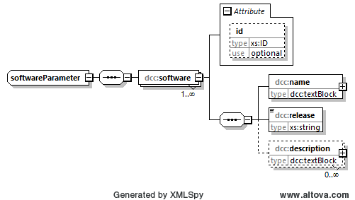

# dcc:dccSoftware

Wesentliche Informationen zur Identifizierung der eingesetzten Software zur Erstellung 
und Bearbeitung des DCC sind hier hinterlegt. 

Welche Software (mit Versionsangabe) wurde für die Erstellung verwendet. Hieraus können 
Rückschlüsse gezogen werden, bei fehlerhaftem XML. Diese Angabe ist z. B. für die 
Fehlersuche immens wichtig.

## Baumstruktur

Die Baumstruktur des Elements *dccSoftware* ergibt sich über den Elementtyp
*dcc:SoftwareParameter*. Er hat folgendes Aussehen:



[Diagrammsoftware](../XSD_diagramviewer.md)

## Grobstruktur des Datentyps *dcc:softwareParameter* vom Element *dcc:software*

```xml
<xs:complexType name="softwareParameter">
    <xs:sequence>
        <xs:element name="software" maxOccurs="unbounded">
            <xs:complexType>
                <xs:sequence>
                    <xs:element name="name" type="dcc:textBlock"/>
                    <xs:element name="release" type="xs:string"/>
                    <xs:element name="description" type="dcc:textBlock" minOccurs="0" 
                    maxOccurs="unbounded" />
                </xs:sequence>
                <xs:attribute name="id" type="xs:ID" use="optional"/>
            </xs:complexType>
        </xs:element>
    </xs:sequence>
</xs:complexType>
```

## Ausfüllanweisungen

Die DCC-XML-Datei wird mit Software erstellt. Der Einsatz dieser Software (eine oder 
mehrere) ist zu dokumentieren. Weitere Informationen zu den Ausfüllanweisungen sind 
in dem Unterabschnitt Elemente zu finden.

### Mindestangaben

im Folgenden werden die Elemente, die auszufüllen sind, in der Überschrift mit einem 
"[R]" (steht für Required) gekennzeichnet. Optional auszufüllende Elemente 
werden mit einem "[O]" gekennzeichnet. 

### Elemente

#### dcc:software [R]
Das Element *dcc:software* darf mehrfach vorkommen. Jeder Eintrag steht für genau eine 
Software, die für die Erstellung XML-Datei eingesetzt wurde. 

##### dcc:name [R]
In dieses Element wird der Name der Software eingegeben. Er kann mehrsprachig 
angegeben werden.

Datentyp: [dcc:textBlock](../auxElements/textBlock.md)

##### dcc:release [R]
Das Release der Software. Mögliche Angaben: Release, Version, etc. Dies dient der 
eindeutigen Identifizierung der Software im Zusammenhang mit dem Namen. 

Datentyp: [xs:string](https://www.w3.org/TR/xmlschema-2/#string)

##### dcc:description [O]
Sonstige Informationen, die nicht in den Elementen *dcc:name* oder *dcc:release* angegeben sind, 
können hier angegeben werden. Das Element kann garnicht, einmal oder mehrfach 
auftreten. Durch den Datentyp textBlock ist hier auch die Mehrsprachigkeit gegeben.

Datentyp: [dcc:textBlock](../auxElements/textBlock.md)

### Attribute

#### xs:ID
Dieser Standard dataType von XML wird zur Darstellung einer eindeutigen ID verwendet. Er 
dient der eindeutigen Kennzeichnung des Objektes im DCC. Es wird hier bewusst der Datentyp 
xs:ID verwendet, da hiermit eine Validierung ohne irgendwelche AddOns in verschiedenen 
Tools ermöglicht wird.

Datentyp: [xs:ID](https://www.w3.org/TR/xmlschema-2/#ID)

## Beispiele
Die Beispiele sind Auszüge aus DCC's.


### Beispiel 1
In diesem Beispiel wird eine Software (Notepad++) für die Esrtellung des DCC verwendet. 
Es sind nur die Pflichtfelder ausgefüllt. Hier das Ergebnis:

```xml
<dcc:dccSoftware>
    <dcc:software>
        <dcc:name>
            <dcc:content>Notepad++ (32-bit)</dcc:content>
        </dcc:name>
        <dcc:release>v7.7.1</dcc:release>
    </dcc:software>
</dcc:dccSoftware>
```

### Beispiel 2
Auf der Basis von Beispiel 1 werden weitere Informationen angegegben:

```xml
<dcc:dccSoftware>
    <dcc:software>
        <dcc:name>
            <dcc:content>Notepad++ (32-bit)</dcc:content>
        </dcc:name>
        <dcc:release>v7.7.1</dcc:release>
        <dcc:description>
            <dcc:content>Erweiterung: XML Tools Plugin version 2.3.2 unicode beta4 r908
            </dcc:content>
        </dcc:description>
        <dcc:description>
            <dcc:content>Installation aus dem Softwarecenter</dcc:content>
        </dcc:description>
    </dcc:software>
</dcc:dccSoftware>
```

### Beispiel 3
Wie Beispiel 2, aber in den Sprachen Deutsch und Englisch:

```xml
<dcc:dccSoftware>
    <dcc:software>
        <dcc:name>
            <dcc:content>Notepad++ (32-bit)</dcc:content>
        </dcc:name>
        <dcc:release>v7.7.1</dcc:release>
        <dcc:description>
            <dcc:content lang="de">Erweiterung: XML Tools Plugin version 2.3.2 unicode beta4 r908
            </dcc:content>
            <dcc:content lang="en">Extension: XML Tools Plugin version 2.3.2 unicode beta4 r908
            </dcc:content>
        </dcc:description>
        <dcc:description>
            <dcc:content lang="de">Installation aus dem Softwarecenter</dcc:content>
            <dcc:content lang="en">Installation from the Software Cente</dcc:content>
        </dcc:description>
    </dcc:software>
</dcc:dccSoftware>
```

### Beispiel 4
Wie Beispiel 3, zusätzlich mit ID's:

```xml
<dcc:dccSoftware>
    <dcc:software id="Notepad_plusplus">
        <dcc:name>
            <dcc:content>Notepad++ (32-bit)</dcc:content>
        </dcc:name>
        <dcc:release>v7.7.1</dcc:release>
        <dcc:descriptionn id="dcc44-1">
            <dcc:content lang="de">Erweiterung: XML Tools Plugin version 2.3.2 unicode beta4 r908
            </dcc:content>
            <dcc:content lang="en">Extension: XML Tools Plugin version 2.3.2 unicode beta4 r908
            </dcc:content>
        </dcc:description>
        <dcc:descriptionn id="dcc44-2">
            <dcc:content lang="de">Installation aus dem Softwarecenter</dcc:content>
            <dcc:content lang="en">Installation from the Software Cente</dcc:content>
        </dcc:description>
    </dcc:software>
</dcc:dccSoftware>
```