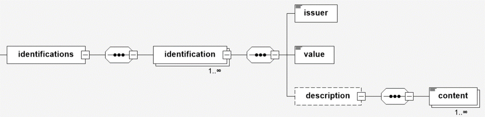

# dcc:identifications

Jedes Kalibriergut wird neben seiner in den weiter oben aufgeführten Inhalte in den 
Elementen noch durch einen oder mehrere Identifier eindeutig gekennzeichnet. Das 
Element *dcc:identifications* ist der Ort, wo diese Information(en) abgespeichert werden.

## Bemerkung

In sehr seltenen Fällen kann es vorkommen, dass keine Identifier an dem Kalibiergut 
vorhanden sind. Daher ist die Eingabe nicht zwingend vorgeschrieben. Es wird empfohlen, 
dass das Kalibrierlaboratorium diesen Mangel abstellt.

## Baumstruktur

Die Baumstruktur des Elements *identifications* hat folgendes Aussehen:



[Diagrammsoftware](../XSD_diagramviewer.md)

## Struktur im XML-Schema

```xml
<xs:element name="identifications" minOccurs="0">
	<xs:complexType>
		<xs:sequence>
			<xs:element name="identification" maxOccurs="unbounded">
				<xs:complexType>
					<xs:sequence>
						<xs:element name="issuer">
							<xs:simpleType>
								<xs:restriction base="xs:string">
									<xs:enumeration value="manufacturer"/>
									<xs:enumeration value="calibrationLaboratory"/>
									<xs:enumeration value="customer"/>
									<xs:enumeration value="owner"/>
									<xs:enumeration value="other"/>
								</xs:restriction>
							</xs:simpleType>
						</xs:element>
						<xs:element name="value" type="xs:string"/>
						<xs:element name="description" type="dcc:textBlock" minOccurs="0"/>
					</xs:sequence>
					<xs:attribute name="id" type="xs:ID" use="optional"/>
				</xs:complexType>
			</xs:element>
		</xs:sequence>
	</xs:complexType>
</xs:element>
```

## Ausfüllanweisungen

Weitere Informationen zu den Ausfüllanweisungen sind in dem Unterabschnitt Elemente
zu finden.

### Mindestangaben

im Folgenden werden die Elemente, die auszufüllen sind, in der Überschrift mit einem 
"[R]" (steht für Required) gekennzeichnet. Optional auszufüllende Elemente 
werden mit einem "[O]" gekennzeichnet. 

Es gibt Elemente, die sind in dem einen Anwendungsfall Pflichtfelder und in dem anderen 
Anwendungsfall nicht zwingend auszufüllen. Diese Elemente werden mit [O|R] gekennzeichnet.


### Elemente

#### dcc:identifications [R]
Das Element ist das Wurzelelement für die Eingabe der Identifier. Es beinhaltet die
Kindelement *identification*, in welchem dann der jeweilige Identifier einzutragen 
ist.

##### dcc:identification [R]

Mindestens ein Element von *dcc:identification* muss ausgefüllt werden. Das Element das 
Kindelelement *dcc:issuer*.

###### dcc:issuer [R]

Das Element *issuer* kann jeweils nur eines der folgenden Inhalte haben:

- manufacturer
- calibrationLaboratory
- customer
- owner
- other

Wird das Element mit einem anderen Inhalt gefüllt, so entsteht bei der Prüfung
gegenüber dem XML-Schema ein Fehler. 


###### dcc:value [R]

Hier wird der Identifier eingetragen. 

Datentyp: [xs:string](https://www.w3.org/TR/xmlschema-2/#string)

###### dcc:description [O]

Sonstige Informationen zum Identifier.

Datentyp: [dcc:textBlock](../auxElements/textBlock.md)

## Beispiele

### Beispiel 1

Der Hersteller hat die Kennnummer 1040917 angegeben:

```xml
<dcc:identifications>
	<dcc:identification>
		<dcc:issuer>manufacturer</dcc:issuer>
		<dcc:value>1040917</dcc:value>
	</dcc:identification>
</dcc:identifications>
```

### Beispiel 2

Der Hersteller hat die Kennnummer 1040917 Sowie die Charge A3/19 angegeben und auch
zwischen der Kennnummer und der Charge eindeutig unterschieden:

```xml
<dcc:identifications>
	<dcc:identification>
		<dcc:issuer>manufacturer</dcc:issuer>
		<dcc:value>1040917</dcc:value>
	</dcc:identification>
		<dcc:description>
			<dcc:content lang="de">Kennnummer</dcc:content>
			<dcc:content lang="en">Serial No.</dcc:content>
		</dcc:description>
	<dcc:identification>
		<dcc:issuer>manufacturer</dcc:issuer>
		<dcc:value>A3/19</dcc:value>
	</dcc:identification>
		<dcc:description>
			<dcc:content lang="de">Charge</dcc:content>
			<dcc:content lang="en">Charge</dcc:content>
		</dcc:description>
</dcc:identifications>
```

### Beispiel 3

Hersteller, Kalibrierlaboratorium und Kunde haben jeweils eine Kennnummer angegeben:

```xml
<dcc:identifications>
	<dcc:identification>
		<dcc:issuer>manufacturer</dcc:issuer>
		<dcc:value>1040917</dcc:value>
		<dcc:description>
			<dcc:content lang="de">Kennnummer</dcc:content>
			<dcc:content lang="en">Serial No.</dcc:content>
		</dcc:description>
	</dcc:identification>
	<dcc:identification>
		<dcc:issuer>calibrationLaboratory</dcc:issuer>
		<dcc:value>PTB4711</dcc:value>
		<dcc:description>
			<dcc:content lang="de">Kennnummer</dcc:content>
			<dcc:content lang="en">Serial No.</dcc:content>
		</dcc:description>
	</dcc:identification>
	<dcc:identification>
		<dcc:issuer>customer</dcc:issuer>
		<dcc:value>0815</dcc:value>
		<dcc:descriptio>
			<dcc:content lang="de">Kennnummer</dcc:content>
			<dcc:content lang="en">Serial No.</dcc:content>
		</dcc:description>
	</dcc:identification>
</dcc:identifications>
```

