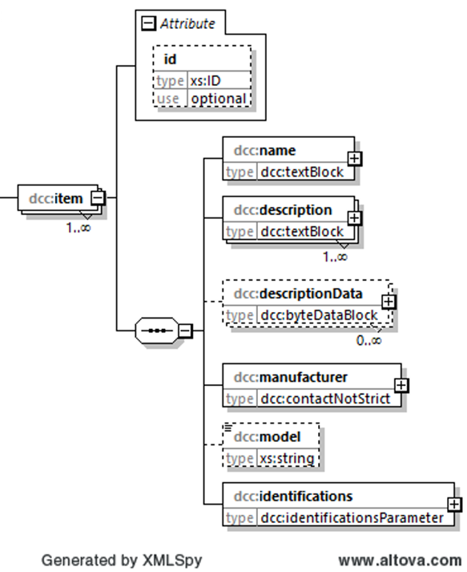

# dcc:item

Das Element *dcc:item* enthält alle notwendigen Informationen, einen einzelnen Kalibriergegenstand 
zu identifizieren und zu beschreiben. Dabei kann das Element mit seinen Kindelementen 
eine komplexe Zusammensetzung abbilden. Daher wird in diesem Teil des Wiki zunächst die 
grobe Struktur des Elements dargestellt. Für die feinere Untergliederung sei auf die 
Verlinkungen verwiesen. 

## Baumstruktur

Die grobe Baumstruktur des Elements *item* hat folgendes Aussehen:



[Diagrammsoftware](../XSD_diagramviewer.md)

### Bemerkung
Auf die Darstellung der Unterelemente des Kindelementes *dcc:identifications* wird hier aus 
Anschauungsgründen verzichtet. In der nun folgenden XML-Darstellung wird dafür 

```xml
<xs:element name="identifications"></xs:element>
```

als Platzhalter verwendet. Der Wiki zum Element *dcc:identifications* ist hier zu finden:
[dcc:identifications](identifications.md)


## Struktur im XML-Schema

```xml
<xs:element name="item" maxOccurs="unbounded">
	<xs:complexType>
		<xs:sequence>
			<xs:element name="name" type="dcc:textBlock" />
			<xs:element name="description" type="dcc:textBlock" maxOccurs="unbounded"/>
			<xs:element name="descriptionData" type="dcc:byteDataBlock" minOccurs="0" 
			maxOccurs="unbounded"/>
			<xs:element name="manufacturer" type="dcc:contactNotStrict"/>
			<xs:element name="model" type="xs:string" minOccurs="0"/>
			<xs:element name="identifications" />
		</xs:sequence>
		<xs:attribute name="id" type="xs:ID" use="optional"/>
	</xs:complexType>
</xs:element>
```

### Elemente

#### dcc:name [R]
In dieses Element wird der Name des des Kalibrierguts angegeben. 

Datentyp: [dcc:textBlock](../auxElements/textBlock.md)

#### dcc:description [R]
Sonstige Informationen, die nicht in den Elementen *dcc:name* angegeben sind, werden
hier angegeben, um so das Kalibriergut zu beschreiben.

Datentyp: [dcc:textBlock](../auxElements/textBlock.md)

#### dcc:descriptionData [O]
Sonstige Informationen, die als Datei vorliegen (z. B. eine Produktbeschreibung), 
können hier angegeben werden.

Datentyp: [dcc:byteDataBlock](../auxElements/byteDataBlock.md)

#### dcc:manufacturer [R]
Hier werden die Angaben zum Hersteller des Kalibrierguts eingetragen. Da es sein 
kann, dass die Angaben zur Adresse des Herstellers gar nicht mehr möglich sind, 
wird hier der Datentyp *dcc:contactNotStrict* verwendet, der wenig Pflichtfelder 
enthält.


Datentyp: [dcc:contactNotStrict](../auxElements/contactNotStrict.md)

#### dcc:model [O]
Sonstige Informationen, die nicht in den zuvor aufgeführten Elementen eine Aussage 
über das Modell oder die Variante des eingesetzten Kalibriergegenstandes gemacht wurden.

Datentyp: [xs:string](https://www.w3.org/TR/xmlschema-2/#string)


#### dcc:identifications [R]
Jedes Kalibriergut wird neben seiner in den weiter oben aufgeführten Inhalte in den 
Elementen noch durch einen oder mehrere Identifier ID eindeutig gekennzeichnet. Das 
Element *dcc:identifications* ist der Ort, wo diese Information(en) abgespeichert werden.

Datentyp: [dcc:identifications](identifications.md)

### Attribute

#### xs:ID
Dieser Standard dataType von XML wird zur Darstellung einer eindeutigen ID verwendet. Er 
dient der eindeutigen Kennzeichnung des Objektes im DCC. Es wird hier bewusst der Datentyp 
xs:ID verwendet, da hiermit eine Validierung ohne irgendwelche AddOns in verschiedenen 
Tools ermöglicht wird.

Datentyp: [xs:ID](https://www.w3.org/TR/xmlschema-2/#ID)
