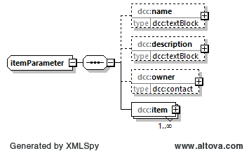

# dcc:items

Das Element *dcc:items* enthält alle notwendigen Informationen, um einen Satz von 
Kalibriergegenständen bzw. einen einzelnen Kalibriergegenstand zu identifizieren 
und zu beschreiben. Dabei kann das Element mit seinen Kindelementen eine komplexe 
Zusammensetzung abbilden. Daher wird in diesem Teil des Wiki zunächst die grobe 
Struktur des Elements dargestellt. Für die feinere Untergliederung sei auf die 
Verlinkungen verwiesen. In diesem Teil des Wiki wird auf die nähere Betrachtung des 
Elementes item auf einen weiterführenden Wiki verwiesen. 

## Baumstruktur

Die grobe Baumstruktur des Elements *dcc:items* ergibt sich über den Elementtyp
*dcc:itemParameter*. Er hat folgendes Aussehen:



[Diagrammsoftware](../XSD_diagramviewer.md)

## Struktur im XML-Schema

### Bemerkung
Auf die Darstellung der Unterelemente des Kindelementes item wird hier aus 
Anschauungsgründen verzichtet. In der nun folgenden XML-Darstellung wird dafür 

```xml
<xs:element name="item" maxOccurs="unbounded"></xs:element>
```

als Platzhalter verwendet. Der Wiki zum Element *dcc.item* ist hier zu finden:
[dcc:item](item.md)

### Grobstruktur des Elementtyp *dcc:itemParameter* vom Element *dcc:items*

```xml
<xs:complexType name="itemParameter">
	<xs:sequence>
		<xs:element name="name" type="dcc:textBlock" minOccurs="0"/>
		<xs:element name="description" type="dcc:textBlock" minOccurs="0"/>
		<xs:element name="owner" type="dcc:contact" minOccurs="0"/>
		<xs:element name="item" maxOccurs="unbounded"></xs:element>
	</xs:sequence>
</xs:complexType>

```

## Ausfüllanweisungen

Weitere Informationen zu den Ausfüllanweisungen sind in dem Unterabschnitt Elemente
zu finden.

### Mindestangaben

|[R] <br> Required|[O] <br> Optional|[R\|O]<br>Required \| Optional|
|-|-|-|
|Es handelt sich um ein Pflichtfeld. | Es handelt sich um ein optionales Feld.|Dieses Feld kann je nach Anwendungsfall ein Pflichtfeld sein.|

### Elemente
|Element||Bemerkung|
|-|:-:|-|
|dcc:name <br>[dcc:textBlock](../auxElements/textBlock.md)|[O]|In dieses Element wird der Name des des Kalibrierguts bzw. des zu kalibrierenden Ensembles angegeben.|
|dcc:description <br>[dcc:textBlock](../auxElements/textBlock.md)|[O]|Sonstige Informationen, die nicht in den Elementen *dcc:name* oder *dcc:equipmentClass* angegeben sind, können hier angegeben werden.|
|dcc:owner <br>[dcc:contact](../auxElements/contact.md)|[O]|Das Element *dcc:owner* enthält alle notwendigen Informationen, um den Eigentümer des Kalibriergegenstandes bzw. der Kalibriergegenstände eindeutig zu identifizieren.|
|dcc:item [R]<br>[dcc:item](item.md)|[R]|Das Element *dcc:item* enthält alle notwendigen Informationen jedes einzelnen Kalibriergegenstandes, um ihn eindeutig zu identifizieren. |

