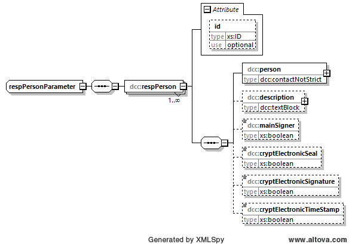

# dcc:respPersonParameter

Der Elementtyp *dcc:respPersonParameter* wird die für die Freigabe des Berichts verantwortliche 
Person benötigt.

## Baumstruktur 

Die Baumstruktur des Elementtyps *dcc:respPersonParameter* hat folgendes Aussehen:



[Diagrammsoftware](../XSD_diagramviewer.md)


## Grobstruktur des Elementtyps *dcc:respPersonParameter* vom Element *respPersons*
```xml
<xs:complexType name="respPersonParameter">
	<xs:sequence>
		<xs:element name="respPerson" maxOccurs="unbounded">
			<xs:complexType>
				<xs:sequence>
					<xs:element name="person" type="dcc:contactNotStrict"/>
					<xs:element name="description" type="dcc:textBlock" minOccurs="0"/>
					<xs:element name="mainSigner" type="xs:boolean" minOccurs="0"/>
					<xs:element name="cryptElectronicSeal" type="xs:boolean" minOccurs="0"/>
					<xs:element name="cryptElectronicSignature" type="xs:boolean" minOccurs="0"/>
					<xs:element name="cryptElectronicTimeStamp" type="xs:boolean" minOccurs="0"/>
				</xs:sequence>
				<xs:attribute name="id" type="xs:ID" use="optional"/>
			</xs:complexType>
		</xs:element>
	</xs:sequence>
</xs:complexType>
```


## Ausfüllanweisungen

Weitere Informationen zu den Ausfüllanweisungen sind in dem Unterabschnitt Elemente
zu finden.

### Mindestangaben

|[R] <br> Required|[O] <br> Optional|[R\|O]<br>Required \| Optional|
|-|-|-|
|Es handelt sich um ein Pflichtfeld. | Es handelt sich um ein optionales Feld.|Dieses Feld kann je nach Anwendungsfall ein Pflichtfeld sein.|

### Elemente
|Element||Bemerkung|
|-|:-:|-|
|dcc:person <br>[dcc:contactNotStrict](../auxElements/contactNotStrict.md)|[R]|Name der Person und ihre Kontaktdaten.| 
|dcc:description<br>[dcc:textBlock](../auxElements/textBlock.md)| [O]|Weitergehende Beschreibung zur Person, soweit sie nicht im Element *person* erfolgen konnte. |
|dcc:mainSigner <br>[xs:boolean](https://www.w3.org/TR/xmlschema-2/#boolean)|[R\|O]|Eine Person soll die Gesamtverantwortung für den DCC übernehmen. Daher soll der Wert für das Kindelement *mainSigner* bei genau einem Element von *respPerson* den Wert "WAHR" haben.| 
|dcc:cryptElectronicSeal <br>[xs:boolean](https://www.w3.org/TR/xmlschema-2/#boolean)|[O]|Ist die Person für die Anbringung des kryptographischen elektronischen Siegels verantwortlich? In diesem Fall soll das ELement *cryptElectronicSeal* den Wert "WAHR" haben.| 
|dcc:cryptElectronicSignature <br>[xs:boolean](https://www.w3.org/TR/xmlschema-2/#boolean)|[O]|Ist die Person für die Anbringung der kryptographischen elektronischen Signatur verantwortlich? In diesem Fall soll das Element *cryptElectronicSignature* den Wert "WAHR" haben.| 
|dcc:cryptElectronicTimeStamp <br>[xs:boolean](https://www.w3.org/TR/xmlschema-2/#boolean)|[O]|Ist die Person für die Anbringung des kryptographischen elektronischen Zeitstempels verantwortlich? In diesem Fall soll das ELement *cryptElectronicTimeStamp* den Wert "WAHR" haben. |


### Attribute

|Attribut|Bemerkung|
|-|-|
|xs:ID<br>[xs:ID](https://www.w3.org/TR/xmlschema-2/#ID)|Dieser Standard dataType von XML wird zur Darstellung einer eindeutigen ID verwendet. Er dient der eindeutigen Kennzeichnung des Objektes im DCC. Es wird hier bewusst der Datentyp xs:ID verwendet, da hiermit eine Validierung ohne irgendwelche AddOns in verschiedenen Tools ermöglicht wird.|