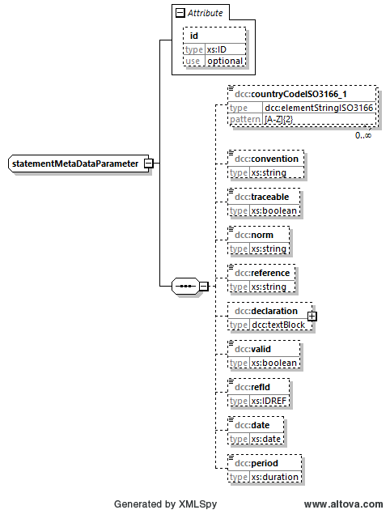

# dcc:statementMetaDataParameter

In dem Elementtyp *dcc:statementMetaDataParameter* werden Aussagen zur Kalibrierung hinterlegt, 
die für den gesamten Kalibrierprozess gelten. 

## Baumstruktur

Die Baumstruktur des Elements *dcc:statementMetaDataParameter* hat folgendes Aussehen:



[Diagrammsoftware](../XSD_diagramviewer.md)


## Aufbau
```xml
<xs:complexType name="statementParameter">
    <xs:sequence>
        <xs:element name="statement" type="dcc:statementMetaDataParameter" maxOccurs="unbounded"/>
    </xs:sequence>
</xs:complexType>
```
