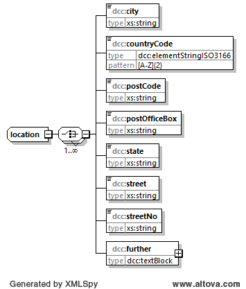

# location

Der Elementtyp *dcc:location* dient zur Eingabe der Adresse.

## Baumstruktur

Die grobe Baumstruktur des Elementtyps *dcc:location* hat folgendes Aussehen:



[Diagrammsoftware](../XSD_diagramviewer.md)

## Grobstruktur des Elementtyps *dcc:location* 
```xml
<xs:complexType name="location">
	<xs:choice maxOccurs="unbounded">
		<xs:element name="city" type="xs:string"/>
		<xs:element name="countryCode" type="dcc:elementStringISO3166"/>
		<xs:element name="postCode" type="xs:string"/>
		<xs:element name="postOfficeBox" type="xs:string"/>
		<xs:element name="state" type="xs:string"/>
		<xs:element name="street" type="xs:string"/>
		<xs:element name="streetNo" type="xs:string"/>
		<xs:element name="further" type="dcc:textBlock"/>
	</xs:choice>
</xs:complexType>
```

## Ausfüllanweisungen

### Mindestangaben

Wenn ein Element vom Type *dcc:location* verwendet wird, enthält dieses Pflichtfelder die wie folgt gekennzeichnet sind.
|[R] <br> Required|[O] <br> Optional|[R\|O]<br>Required \| Optional|
|-|-|-|
|Es handelt sich um ein Pflichtfeld. | Es handelt sich um ein optionales Feld.|Dieses Feld kann je nach Anwendungsfall ein Pflichtfeld sein.|

### Bemerkungen

Die Kindelemente des Elements *location* können in beliebiger Reiehenfolge beliebig 
oft eingegeben werden. Die Motivation dafür liegt in der Unterschiedlichkeit der 
Angabe von Adressen in den Staaten. 

Die Überprüfung auf logische Rictigkeit kann nicht durch das XML-Schema erfolgen.

### Elemente

|Element||Bemerkung|
|-|:-:|-|
|city<br>[xs:string](https://www.w3.org/TR/xmlschema-2/#string)| [O\|R]|Der Name der Stadt.|
|countryCode<br>[dcc:elementStringISO3166](../auxElements/elementStringISO3166.md)|[O\|R]|Der Ländercode, bestehend aus zwei Großbuchstaben.|
|postCode<br>[xs:string](https://www.w3.org/TR/xmlschema-2/#string)| [O\|R]|Die Postleitzahl.|
|postOfficeBox<br>[xs:string](https://www.w3.org/TR/xmlschema-2/#string)| [O\|R]|Das Postfach.|
|state <br>[xs:string](https://www.w3.org/TR/xmlschema-2/#string)| [O\|R]|Das Bundesland.|
|street<br>[xs:string](https://www.w3.org/TR/xmlschema-2/#string)| [O\|R]|Der Straßenname.|
|streetNo<br>[xs:string](https://www.w3.org/TR/xmlschema-2/#string)| [O\|R]|Die Hausnummer.|
|further<br>[dcc:textBlock](../auxElements/textBlock.md) |[O\|R]|Angabe von zusätzlichen Informationen, die für eine genaue Postanschrift dienlich sind.|
