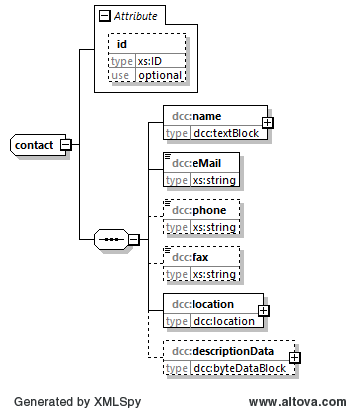

# contact

Das Element *contact* dient zur Eingabe von Kontaktdaten.

## Baumstruktur

Die grobe Baumstruktur des Elements *contact* hat folgendes Aussehen:



[Diagrammsoftware](../XSD_diagramviewer.md)

## Grobstruktur des Datentyps *dcc:contact* 
```xml
<xs:complexType name="contact">
	<xs:sequence>
		<xs:element name="name" type="dcc:textBlock"/>
		<xs:element name="eMail" type="xs:string"/>
		<xs:element name="phone" type="xs:string" minOccurs="0"/>
		<xs:element name="fax" type="xs:string" minOccurs="0"/>
		<xs:element name="location" type="dcc:location"/>
		<xs:element name="descriptionData" type="dcc:byteDataBlock" minOccurs="0"/>
	</xs:sequence>
	<xs:attribute name="id" type="xs:ID" use="optional"/>
</xs:complexType>
```

## Ausfüllanweisungen

Das Element *contact* ist optional. Wenn es ausgefüllt wird, so sind
im Folgenden werden die Elemente, die auszufüllen sind, in der Überschrift mit einem
"[R]" (steht für Required) gekennzeichnet. Optional auszufüllende Elemente
werden mit einem "[O]" gekennzeichnet.

### Mindestangaben

im Folgenden werden die Elemente, die auszufüllen sind, in der Überschrift mit einem 
"[R]" (steht für Required) gekennzeichnet. Optional auszufüllende Elemente 
werden mit einem "[O]" gekennzeichnet. 

Es gibt Elemente, die sind in dem einen Anwendungsfall Pflichtfelder und in dem anderen 
Anwendungsfall nicht zwingend auszufüllen. Diese Elemente werden mit [O|R] gekennzeichnet.

#####  

Für den Sitz in Deutschland gilt:

Bei juristischen Personen sind die Angaben aus dem Handelsregister und bei
natürlichen Personen der Erstwohnsitz anzugeben. Bei Behörden sind die Angaben 
aus dem Impressum des Webauftritts anzugeben.

### Elemente

#### name [R]

Angabe des Namens der juristischen oder natürlichen Person.

Datentyp: [dcc:textBlock](../auxElements/textBlock.md)

#### eMail [R]

Angabe der E-Mail-Adresse der juristischen oder natürlichen Person.

Datentyp: [xs:string](https://www.w3.org/TR/xmlschema-2/#string)

#### phone [O]

Angabe der Telefonnummer der juristischen oder natürlichen Person.

Datentyp: [xs:string](https://www.w3.org/TR/xmlschema-2/#string)

#### fax [O]

Angabe der Telefaxnummer der juristischen oder natürlichen Person.

Datentyp: [xs:string](https://www.w3.org/TR/xmlschema-2/#string)

####  [R]

Angaben zur Adresse der juristischen oder natürlichen Person.

Datentyp: [dcc:location](../auxElements/location.md)

#### descriptionData [O]

Zusätzliche Angaben der juristischen oder natürlichen Person.

Datentyp: [dcc:byteDataBlock](../auxElements/byteDataBlock.md)

### Attribute

#### ID
Dieser Standard dataType von XML wird zur Darstellung einer eindeutigen ID verwendet.

Die eindeutige Kennzeichnung des Objektes im DCC. Es wird hier bewusst der Datentyp 
xs:ID verwendet, da hiermit eine Validierung ohne irgendwelche AddOns in verschiedenen 
Tools ermöglicht wird.

Datentyp: [xs:ID](https://www.w3.org/TR/xmlschema-2/#ID)

