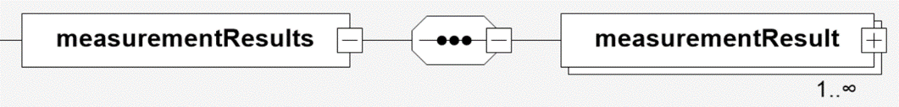

# dcc:measurementResults

Das Element *dcc:measurementResults* enthält alle Ergebnisse der Messungen und Auswertungen 
Informationen zur Kalibrierung. Die Eintragungen in diesem Bereich sind immer so, dass 
ein Wert immer mit einer Einheit verknüpft ist. Es sollten immer SI-Einheiten verwendet 
werden. 

## Baumstruktur

Die Baumstruktur des Elements *dcc:measurementResults* hat folgendes Aussehen:

[Diagrammsoftware](../XSD_diagramviewer.md)

## Ausfüllanweisungen

Weitere Informationen zu den Ausfüllanweisungen sind in dem Unterabschnitt Elemente
zu finden.

### Mindestangaben

im Folgenden werden die Elemente, die auszufüllen sind, in der Überschrift mit einem 
"[R]" (steht für Required) gekennzeichnet. Optional auszufüllende Elemente 
werden mit einem "[O]" gekennzeichnet. 

Es gibt Elemente, die sind in dem einen Anwendungsfall Pflichtfelder und in dem anderen 
Anwendungsfall nicht zwingend auszufüllen. Diese Elemente werden mit [O|R] gekennzeichnet.

### Elemente

Das Element *dcc:measurementResults* hat nur das Kindelemenent *dcc:measurementResult*.

#### dcc:measurementResults [R]
Das Element *dcc:measurementResults* kann beliebeig oft aufgerufen werden. 
