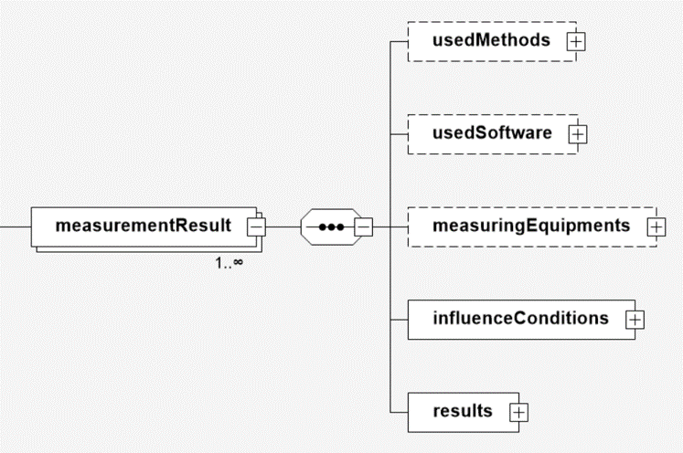

# measurementResult

Das Element *measurementResults* enthält alle Ergebnisse der Messungen und Auswertungen 
Informationen zur Kalibrierung. Die Eintragungen in diesem Bereich sind immer so, dass 
ein Wert immer mit einer Einheit verknüpft ist. Es sollten immer SI-Einheiten verwendet 
werden. 

## Baumstruktur

Die Baumstruktur des Elements *measurementResult* hat folgendes Aussehen:



[Diagrammsoftware](../XSD_diagramviewer.md)

## Ausschnitt aus dem XML-Schema
```xml
<xs:element name="measurementResults">
	<xs:complexType>
		<xs:sequence>
			<xs:element name="measurementResult" maxOccurs="unbounded">
				<xs:complexType>
					<xs:sequence>
						<xs:element name="usedMethods" type="dcc:usedMethodParameter" minOccurs="0"/>
						<xs:element name="usedSoftware" type="dcc:softwareParameter" minOccurs="0"/>
						<xs:element name="measuringEquipments" type="dcc:measuringEquipmentParameter" minOccurs="0"/>
						<xs:element name="influenceConditions" type="dcc:influenceConditionParameter"/>
						<xs:element name="results" type="dcc:resultParameter"/>
					</xs:sequence>
				</xs:complexType>
			</xs:element>
		</xs:sequence>
	</xs:complexType>
</xs:element>
```
## Ausfüllanweisungen

Weitere Informationen zu den Ausfüllanweisungen sind in dem Unterabschnitt Elemente
zu finden.

### Mindestangaben

im Folgenden werden die Elemente, die auszufüllen sind, in der Überschrift mit einem 
"[R]" (steht für Required) gekennzeichnet. Optional auszufüllende Elemente 
werden mit einem "[O]" gekennzeichnet. 

Es gibt Elemente, die sind in dem einen Anwendungsfall Pflichtfelder und in dem anderen 
Anwendungsfall nicht zwingend auszufüllen. Diese Elemente werden mit [O|R] gekennzeichnet.


### Elemente

#### [dccSoftware [R]](dccSoftware.md)
Wesentlichen Informationen zur Identifizierung der eingesetzten Software zur Erstellung 
und Bearbeitung des DCC sind hier hinterlegt. 

#### [coreData [R]](coreData.md)
Wesentliche Informationen zur Identifizierung des Kalibriergutes sowie der globalen 
Einordnung des Kalibrierscheins.
 
#### [items [R]](items.md)
Eindeutige Identifizierung, Beschreibung und ggf. Zustand des Kalibriergegenstands.

#### [calibrationLaboratory [R]](calibrationLaboratory.md)
Wesentlichen Informationen zur Identifizierung des Kalibrierlaboratoriums.

#### [respPersons [R]](respPersons.md)
Benennung der für die Freigabe des Berichts verantwortlichen Person(en).

#### [customer [R]](customer.md)
Identifizierung des Auftraggebers der Kalibrierung.

#### [statements [O]](statements.md)
Element für die Eingabe diverser Statements.
