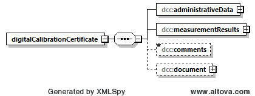

# Das Wurzelelement und seine Elemente
Das Wurzelelement *dcc:digitalCalibrationCertificate* hat vier Elemente:

[Diagrammsoftware](XSD_diagramviewer.md)

## Grobe Beschreibung der Funktion der vier Elemente

### [dcc:administrativeData](administrativeData/README.md)
Das Element *administrativeData* enthält alle wesentlichen administrativen Informationen 
zur Kalibrierung. Die Eintragungen in diesem Bereich sind in allen DCC prinzipiell 
gleich und reglementiert.

### [dcc:measurementResult](measurementResult/README.md)
Im Element *measurementResult* werden alle Informationen zum Ergebnis der Messung 
hinterlegt. Die Mess- und Ergebnisdaten müssen einen Wert und eine Einheit haben. 
Die Einheit ist idealerweise eine SI-Einheit. 

Aufgrund der unterschiedlichen Anforderungen in den einzelnen Bereichen an die 
Kalibrierung unterscheiden sich die DCC entsprechend. So ist es logisch, dass 
sich DCC's aus dem Bereich der Akustik von denen aus dem Bereich der Zyklotronstrahlung 
unterscheiden.

### [dcc:comments](comments/README.md)

In dieses Element können alle weiteren Informationen und Dateien eingefügt werden, 
die zwischen Auftraggeber und Kalibrierlaboratorium vereinbart wurden. Dateien 
unterschiedlichster Art (z. B. Ergebnisse aus Tabellenkalkulationsprogrammen) werden 
dazu mithilfe des Base64-Verfahrens [^1] so umgewandelt, dass sie in der XML-Struktur 
gespeichert werden können. Aus der XML-Struktur können sie dann wieder entnommen 
werde und mit dem Base64-Verfahren fehlerfrei wieder zurückgewandelt werden. 

[^1]: https://tools.ietf.org/html/rfc4648

### [dcc:document](document/README.md)

Das Element *document* enthält die menschenlesbare Variante des DCC. 

----

