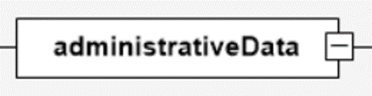
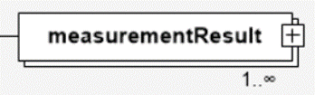
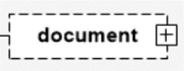
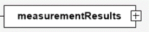
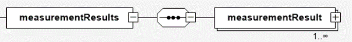
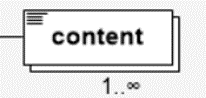
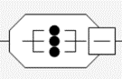
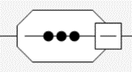
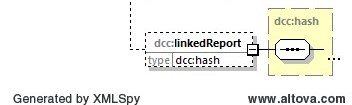

# XSD Diagram Viewer

## Source

For the representation of the structure of the DCC schema we use two different software tools. For simple structures the software *XSD Diagram* [^1] is used. If it is important to display more information, such as the type of data used for an element or its attributes, we use *Altova XMLSpy 2018* [^2] software. These representations are marked with the software hint.

[^1]: *XSD Diagram is a free xml schema definition diagram viewer (http://regis.cosnier.free.fr).
Version 1.2 Copyright (c) 2006-2018 Regis Cosnier, All Rights Reserved.
This program is free software and may be distributed
according to the terms of the GNU General Public License (GPL).*

[^2]: XMLSpy Verion 2018 des Herstellers Altova GmbH, Rudolfsplatz 13a/9, A-1010 Wien 
https://www.altova.com/de/xmlspy-xml-editor

## Nomenclature

### Frequency of elements

XML elements can occur different times. To do this, XSD Diagram uses the option the following nomenclature:

||||
|-|-|-|
| exactly 1: |  ||
| 1 to unbounded: |  | Other entries are also possible, e.g. 0 - unbounded times or 3 to 7 times.|
|0 or 1: |  ||

### Child elements

If an element has child elements, there is a link on the right side with a "+". If you click on it, you will see the elements of the next level.

| | |
|---|---|
| collapsed: |   |
| opened: | |
|Element without Child:| |

### Arrangement and selection of child elements

| | |
|---|---|
|The child elements can be arranged in **any order**.||
|The child elements must be arranged in the **current order**.||
|Exactly **one** child element must be selected.||
|Recursively called elements, here as an example the element *dcc:hash* - are displayed as follows:|

