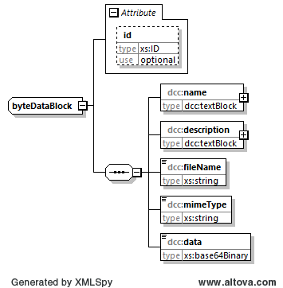

# dcc:byteDataBlock
The element type *dcc:byteDataBlock* is used to enter any information available as electronic data.

## Tree structure

The tree structure of the element type *dcc:byteDataBlock* has the following layout:



[chart software](../XSD_diagramviewer.md)

## Rough structure of element type *dcc:byteDataBlock* 
```xml
<xs:complexType name="byteDataBlock">
	<xs:sequence>
		<xs:element name="name" type="dcc:textBlock"/>
		<xs:element name="description" type="dcc:textBlock"/>
		<xs:element name="fileName" type="xs:string"/>
		<xs:element name="mimeType" type="xs:string"/>
		<xs:element name="data" type="xs:base64Binary"/>
	</xs:sequence>
	<xs:attribute name="id" type="xs:ID" use="optional"/><!--92200_A_I-->
</xs:complexType>
```

## Completion instructions

For more information on the completion instructions, see the Elements subsection.

### Minimum requirements

The element *dcc:byteDataBlock* is optional. If it is filled in, it contains mandatory fields marked as follows.

|[R] <br> Required|[O] <br> Optional|[R\|O]<br>Required \| Optional|
|-|-|-|
|This is a mandatory field. | This is an optional field.|This field may be mandatory, depending on the application.|

### Elements
|Element||Note|
|-|-|-|
|dcc:name<br>[dcc:textBlock](../auxElements/textBlock.md) |[R]|Specifies the topic of the file that is attached.|
|dcc:description<br>[dcc:textBlock](../auxElements/textBlock.md)| [R]|Specifies the contents of the attached file.|
|dcc:fileName <br>[xs:string](https://www.w3.org/TR/xmlschema-2/#string)|[R]|Name of the attached file.|
|dcc:mimeType <br>[xs:string](https://www.w3.org/TR/xmlschema-2/#string)|[R]|Specifies the MIME type of the attached file.|
|dcc:data <br>[xs:base64Binary](https://www.w3.org/TR/xmlschema-2/#base64Binary)|[R]|The data is stored in this element after it has been coded using the Base64 [^1] method.

### Note:

The byteDataBlock defines a type that allows to add binary coded files. It is a good practice to use the Base64 Data Encodings standard, RFC 4648 [^1].

Examples for the content are image files or ZIP archives. The fileName element specifies the name of the original file. The element mimeType is the underlying file type (e.g. zip, jpeg, png). Element data contains the base64Binary encoded file.

### Attributes

|Attribut|Comment|
|-|-|
|xs:ID<br>[xs:ID](https://www.w3.org/TR/xmlschema-2/#ID)| This standard dataType of XML is used to represent a unique ID. It is used to uniquely identify the object in the DCC. The data type xs:ID is deliberately used here, as this enables validation without any add-ons in different tools.|

[^1]: Base64 Data Encodings standard, siehe RFC 4648: https://tools.ietf.org/html/rfc4648
