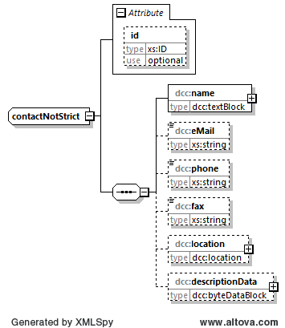

# dcc:contactNotStrict

The element type *dcc:contactNotStrict* is used to enter contact data. It is usually called from other elements. 

## Tree structure

The tree structure of the element type *dcc:contactNotStrict* has the following layout:



[chart software](../XSD_diagramviewer.md)

## Rough structure of element type *dcc:contactNotStrict* 
```xml
<xs:complexType name="contactNotStrict">
	<xs:sequence>
		<xs:element name="name" type="dcc:textBlock"/>
		<xs:element name="eMail" type="xs:string" minOccurs="0"/>
		<xs:element name="phone" type="xs:string" minOccurs="0"/>
		<xs:element name="fax" type="xs:string" minOccurs="0"/>
		<xs:element name="location" type="dcc:location" minOccurs="0"/>
		<xs:element name="descriptionData" type="dcc:byteDataBlock" minOccurs="0"/>
	</xs:sequence>
	<xs:attribute name="id" type="xs:ID" use="optional"/>
</xs:complexType>
```

## Completion instructions

For more information on the completion instructions, see the Elements subsection.

### Minimum requirements

The element *dcc:contactNotStrict* is optional. If it is filled in, it contains mandatory fields marked as follows.

|[R] <br> Required|[O] <br> Optional|[R\|O]<br>Required \| Optional|
|-|-|-|
|This is a mandatory field. | This is an optional field.|This field may be mandatory, depending on the application.|
 
| |
|-|
|The following applies to the registered office in Germany: In the case of legal entities, the information from the commercial register must be stated and in the case of natural persons, the primary residence; in the case of public authorities, the information from the imprint of the website must be stated.|

### Elements
|Element||Note|
|-|-|-|
|dcc:name<br>[dcc:textBlock](../auxElements/textBlock.md)|[R]|Indication of the name of the legal or natural person.|
|dcc:eMail<br>[xs:string](https://www.w3.org/TR/xmlschema-2/#string)|[O]|The e-mail address of the legal or natural person.|
|dcc:phone<br>[xs:string](https://www.w3.org/TR/xmlschema-2/#string)|[O]|The telephone number of the legal or natural person.|
|dcc:fax<br>[xs:string](https://www.w3.org/TR/xmlschema-2/#string)|[O]|Indication of the fax number of the legal or natural person.|
|dcc:location<br>[dcc:location](../auxElements/location.md)|[O]|The address of the legal or natural person.|
|dcc:descriptionData<br>[dcc:byteDataBlock](../auxElements/byteDataBlock.md)|[O]|Additional information provided by the legal or natural person.|

### Attributes

|Attribut|Comment|
|-|-|
|xs:ID<br>[xs:ID](https://www.w3.org/TR/xmlschema-2/#ID)| This standard dataType of XML is used to represent a unique ID. It is used to uniquely identify the object in the DCC. The data type xs:ID is deliberately used here, as this enables validation without any add-ons in different tools.|
