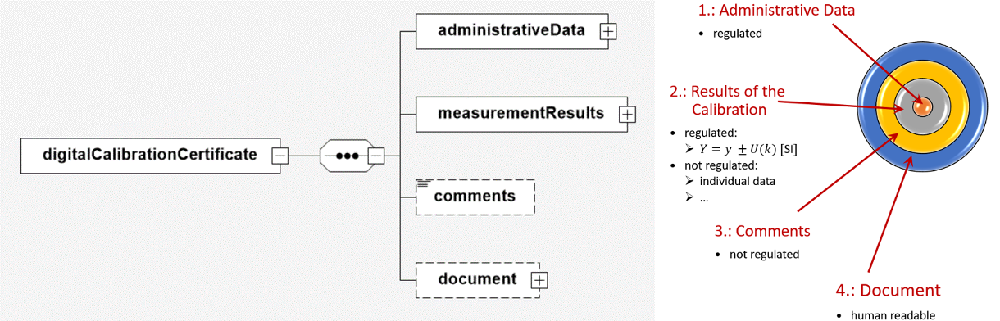

# The Root element and it is elements
The Root element *digitalCalibrationCertificate* has four elements:

[chart software](XSD_diagramviewer.md)

## Rough description of the function of the four elementsw

### [dcc:administrativeData](administrativeData/README.md) (Ring 1)
The *administrativeData* element contains alls the essential administrative information for calibration.
The entries in this area are basically the same and regulated in all DCCs.

### [dcc:measurementResult](measurementResult/README.md) (Ring 2)
The *measurementResult* element stores all information on the result of the measurement.
The measurement and result data must have a value and a unit.
Ideally, the unit is a SI unit. 

Because of the different calibration requirements in the individual areas, the DCCs are different to each other.
It is therefore logical that DCC's in the field of acoustics differ from those in the field of cyclotron radiation.

### [dcc:comments](comments/README.md) (Ring 3)

All further information and files agreed between the customer and the calibration laboratory can be inserted into this element.
Files of various types (e.g. results from spreadsheet programs) are converted using the Base64 method [^1] so that they can be stored in the XML structure.
They can then be removed from the XML structure and converted back without errors using the Base64 method.  

[^1]: https://tools.ietf.org/html/rfc4648

### [dcc:document](document/README.md) (Ring 4)

The element *document* contains the human-readable variant of the DCC.  

